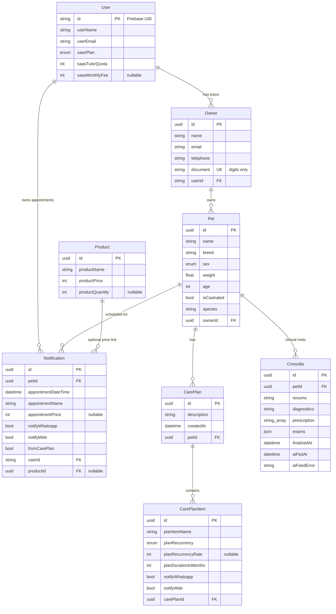

# Handoff: Veterinary SaaS Backend

Human-readable handoff for rebuilding this API in **Java + Quarkus**.

This document describes the current NestJS + Prisma + PostgreSQL backend that powers a veterinary SaaS client (mobile/web). A vet authenticates with Firebase; all tutors, pets, plans, appointments, and consultas are scoped to that vet.

---

## 1. What this product does

| Role | Meaning |
|------|---------|
| **Vet** | Firebase-authenticated user (`User`). Tenant of the system. |
| **Tutor / Owner** | Client of the vet (`Owner`). |
| **Pet** | Animal belonging to a tutor. |
| **Care plan** | Procedures prescribed for a pet (`CarePlan` + `CarePlanItem`). |
| **Appointment** | Scheduled occurrence stored as `Notification` (generated from the plan or created manually). |
| **Consulta** | Clinical visit record (notes, diagnosis, prescriptions, exams, AI-feed metadata). |
| **Product** | Shared catalog used to price appointments. |

The API is a BFF: it does not send WhatsApp/email itself; it stores notify flags and serves data to the client.

**Reference runtime today**

- Local: `http://localhost:3003`
- Deployed example: Render web service + managed Postgres + Firebase project `veti-5a61d`

---

## 2. Suggested Quarkus target stack

| Concern | Current | Suggested Quarkus equivalent |
|---------|---------|------------------------------|
| HTTP API | NestJS controllers | Quarkus REST (`quarkus-rest` / Jackson) |
| Persistence | Prisma 7 + `pg` adapter | Hibernate ORM with Panache **or** jOOQ / SQL + Flyway/Liquibase |
| DB | PostgreSQL | PostgreSQL (keep schema semantics) |
| Validation | Zod | Hibernate Validator / Bean Validation |
| Auth | Firebase Admin ID tokens | Verify Firebase JWT (JWKS) or Admin SDK; map `uid` → `User` |
| Config | env + dotenv | `application.properties` / env |
| Migrations | Prisma Migrate | Flyway or Liquibase |
| Seed | `prisma/seed.ts` | Quarkus startup job or CLI seed |

Preserve **JSON contracts** with the existing mobile app unless you intentionally version the API.

---

## 3. Data model (visual)

### 3.1 Entity-relationship overview



### 3.2 Relationship narrative

```
User (vet)
 ├── Owner (tutor) ─1:N─► Pet
 │                         ├── CarePlan ─1:N─► CarePlanItem
 │                         ├── Notification (appointments)
 │                         └── Consulta (visits)
 └── Notification (also linked directly to User for tenant scope)

Product (global catalog) ─0:N─► Notification.productId
```

- **Tenant boundary:** almost everything is filtered by the authenticated vet’s `User.id`.
- **Owner.document** is **globally unique** (not per-vet).
- **Products** are shared across all vets (not tenant-scoped).
- Deleting a parent cascades as shown below.

### 3.3 Cascade / delete rules

| Parent deleted | Children effect |
|----------------|-----------------|
| `User` | Cascades `Owner`, `Notification` |
| `Owner` | Cascades `Pet` |
| `Pet` | Cascades `CarePlan`, `Notification`, `Consulta` |
| `CarePlan` | Cascades `CarePlanItem` |
| `Product` | Sets `Notification.productId` to `NULL` |

### 3.4 Tables (field reference)

#### Enums

| Enum | Values |
|------|--------|
| `PetSex` | `M`, `F` |
| `PlanRecurrency` | `single`, `recurrent` |
| `SaaSPlan` | `starter`, `growth`, `scale` |

#### `User`

| Column | Type | Notes |
|--------|------|-------|
| `id` | text PK | Firebase UID (or seed id) |
| `userName` | text | |
| `userEmail` | text | |
| `saasPlan` | enum | default `starter` |
| `saasTutorQuota` | int | default `100` |
| `saasMonthlyFee` | int? | overrides catalog fee when set |

#### `Owner`

| Column | Type | Notes |
|--------|------|-------|
| `id` | uuid PK | |
| `name` | text | |
| `email` | text | |
| `telephone` | text | |
| `document` | text UNIQUE | store **digits only** |
| `userId` | text FK → User | |

#### `Pet`

| Column | Type | Notes |
|--------|------|-------|
| `id` | uuid PK | |
| `name`, `breed` | text | |
| `sex` | enum | `M` / `F` |
| `weight` | float | |
| `age` | int | |
| `isCastrated` | bool | |
| `species` | text | default `""` |
| `ownerId` | uuid FK → Owner | |

#### `CarePlan`

| Column | Type | Notes |
|--------|------|-------|
| `id` | uuid PK | |
| `description` | text | |
| `createdAt` | timestamptz | anchor for scheduling |
| `petId` | uuid FK → Pet | |

#### `CarePlanItem`

| Column | Type | Notes |
|--------|------|-------|
| `id` | uuid PK | |
| `planItemName` | text | matched to products by normalized name |
| `planRecurrency` | enum | `single` or `recurrent` |
| `planRecurrencyRate` | int? | months between occurrences |
| `planDurationInMonths` | int | horizon for recurrence |
| `notifyWhatsapp` / `notifyWeb` | bool | copied onto generated appointments |
| `carePlanId` | uuid FK → CarePlan | |

#### `Notification` (appointments)

| Column | Type | Notes |
|--------|------|-------|
| `id` | uuid PK | |
| `petId` | uuid FK → Pet | |
| `appointmentDateTime` | timestamptz | |
| `appointmentName` | text | |
| `appointmentPrice` | int? | |
| `notifyWhatsapp` | bool | default false |
| `notifyWeb` | bool | default true |
| `fromCarePlan` | bool | default true; false for manual |
| `userId` | text FK → User | tenant |
| `productId` | uuid? FK → Product | SetNull on product delete |

#### `Consulta`

| Column | Type | Notes |
|--------|------|-------|
| `id` | uuid PK | |
| `petId` | uuid FK → Pet | |
| `resumo`, `diagnostico` | text | default `""` |
| `prescription` | text[] | default `{}` |
| `exams` | jsonb | default `[]`; items `{ name, date }` |
| `finalizedAt`, `aiFedAt` | timestamptz? | |
| `aiFeedError` | text? | cleared when `aiFedAt` is set |
| `createdAt` / `updatedAt` | timestamptz | |

#### `Product`

| Column | Type | Notes |
|--------|------|-------|
| `id` | uuid PK | |
| `productName` | text | |
| `productPrice` | int | |
| `productQuantity` | int? | |

### 3.5 ASCII relationship map

```
┌────────────────┐
│     User       │  vet / tenant (Firebase uid)
│  (saas plan)   │
└───────┬────────┘
        │ 1
        │
        │ N                 N (appointments also point here)
        ▼                   │
┌────────────────┐          │
│     Owner      │◄─────────┼──────────────────────────────┐
│  document UK   │          │                              │
└───────┬────────┘          │                              │
        │ 1                 │                              │
        │ N                 │                              │
        ▼                   ▼                              │
┌────────────────┐   ┌──────────────────┐                  │
│      Pet       │───│  Notification    │──── optional ──► Product
└───────┬────────┘   │  (appointment)   │                  (global)
        │            └──────────────────┘
        │
        ├──► CarePlan ──► CarePlanItem
        │
        └──► Consulta
```

---

## 4. Authentication & tenancy

1. Client sends `Authorization: Bearer <Firebase ID token>`.
2. Server verifies the token against Firebase project (e.g. `veti-5a61d`).
3. Upsert `User` with `id = token.uid`, refreshing name/email.
4. New users get `saasPlan=starter`, `saasTutorQuota=100`.
5. Every domain query is scoped to that `userId` (except `GET /products` and `GET /`).

**Dev-only:** `AUTH_DEV_BYPASS=true` allows requests without a token as `AUTH_DEV_USER_ID` / `SEED_USER_ID`. Do **not** enable in production.

**Important:** Seed data only appears for the vet whose Firebase UID equals `SEED_USER_ID`.

---

## 5. HTTP API (contract to preserve)

Base path: `/` (no global prefix). CORS enabled.

### Public

| Method | Path | Response |
|--------|------|----------|
| `GET` | `/` | `"Hello World!"` |

### Auth

| Method | Path | Notes |
|--------|------|-------|
| `GET` | `/me` | Current vet profile + SaaS fields |

### Owners & pets

| Method | Path | Purpose |
|--------|------|---------|
| `GET` | `/owner` | List tutors (+ pets); optional `?document=` |
| `GET` | `/owner/:id` | Owner + pets |
| `POST` | `/owner` | Create owner + ≥1 pet |
| `POST` | `/owner/:id/pet` | Add pet |
| `GET` | `/owner/:petId/plan` | Plan view (appointments list) |
| `POST` | `/owner/:petId/plan` | Replace care plan + regenerate appointments |
| `PATCH` | `/owner/:petId/plan` | Update notify flags on appointments |
| `POST` | `/owner/:petId/plan/appointments` | Manual appointment (`productId` + date) |
| `DELETE` | `/owner/:petId/plan/appointments/:appointmentId` | Remove appointment |

**Create owner body**

```json
{
  "owner": { "name": "", "email": "", "telephone": "", "document": "" },
  "pet": [
    {
      "name": "",
      "breed": "",
      "sex": "M",
      "weight": 0,
      "age": 0,
      "isCastrated": false,
      "species": ""
    }
  ]
}
```

**Create plan body**

```json
{
  "carePlanDescription": "",
  "carePlan": [
    {
      "planItemName": "v10",
      "planRecurrency": "recurrent",
      "planRecurrencyRate": 12,
      "planDurationInMonths": 24,
      "notifyWhatsapp": false,
      "notifyWeb": true
    }
  ]
}
```

**Plan GET response shape** (note: `carePlan` here is the **appointment list**, not items)

```json
{
  "carePlanDescription": "...",
  "carePlan": [
    {
      "id": "uuid",
      "appointmentName": "v10",
      "appointmentPrice": 120,
      "appointmentDate": "ISO-8601",
      "ownerContact": "...",
      "notifyWhatsapp": false,
      "notifyWeb": true
    }
  ]
}
```

### Notifications

| Method | Path | Purpose |
|--------|------|---------|
| `GET` | `/notifications` | Vet’s web-visible appointments (`notifyWeb=true`) |
| `GET` | `/notifications/:ownerId` | Same, filtered by owner |

Query params: `page`, `dateFrom`, `dateTo` (see current Nest implementation for paging quirks).

### Consultas

| Method | Path | Purpose |
|--------|------|---------|
| `POST` | `/consulta` | `{ "petId" }` — create empty shell |
| `GET` | `/consulta?petId=` | Latest consulta for pet (**404 if none**) |
| `GET` | `/consulta/:id` | By id |
| `PATCH` | `/consulta/:id` | Update clinical / AI fields |

Seed does **not** create consultas; clients must `POST` first.

### Dashboard & products

| Method | Path | Purpose |
|--------|------|---------|
| `GET` | `/dashboard` | KPIs: ticket médio, LTV, payback, pacientes, receita, rentabilidade |
| `GET` | `/products?q=` | Global product catalog (optional name search) |

Dashboard timezone logic uses **America/Sao_Paulo**.

---

## 6. Core business rules to reimplement

### Care plan → appointments

1. Creating a plan **deletes** existing care plans for that pet and all notifications with `fromCarePlan=true`.
2. Generate `Notification` rows from each item:
   - Timezone: America/Sao_Paulo.
   - Sundays are nudged +1 day.
   - `single` → one occurrence at plan creation.
   - `recurrent` → every `planRecurrencyRate` months for `planDurationInMonths`.
3. Resolve price/product by **normalized name match** (NFD, strip diacritics, lower/trim) against `Product.productName`.

### Manual appointments

- Require an existing care plan.
- Set `fromCarePlan=false`.
- Name/price come from the selected `Product`.

### Document normalization

- Persist owner `document` as digits only.

### SaaS fee (dashboard payback)

Catalog interpolates monthly fee by plan + tutor quota (starter / growth / scale bands). `User.saasMonthlyFee` overrides when set.

### Consulta AI fields

- Setting `aiFedAt` clears `aiFeedError`.

---

## 7. Seed expectations

Destructive wipe + recreate:

1. Catalog of ~15 products (vaccines, check-up, etc.).
2. One vet `User` with `id = SEED_USER_ID`.
3. Four tutors / five pets (demo names: Thor, Mel, Nina, Bob, Rex).
4. Care plans for Thor and Mel + generated appointments.
5. Synthetic historical appointments for dashboard charts.

Always seed production with the real vet Firebase UID.

---

## 8. Environment variables

| Variable | Purpose |
|----------|---------|
| `DATABASE_URL` | Postgres connection string |
| `PORT` | HTTP port (default 3003) |
| `FIREBASE_PROJECT_ID` | Must match token audience (e.g. `veti-5a61d`) |
| `FIREBASE_SERVICE_ACCOUNT` | Optional service-account JSON (single line) |
| `AUTH_DEV_BYPASS` | Local-only unauthenticated mode |
| `AUTH_DEV_USER_ID` / `SEED_USER_ID` | Dev / seed vet id |
| `AUTH_DEBUG` | Include Firebase error detail in 401 responses |

Wrong `FIREBASE_PROJECT_ID` → 401 on all protected routes.

---

## 9. Non-functional notes for Quarkus

- Prefer OpenAPI generation matching the paths above.
- Use UUID primary keys for domain entities (except `User.id` = string Firebase uid).
- Use PostgreSQL enums or check constraints matching Prisma enums.
- Store `Consulta.exams` as JSONB; `prescription` as `text[]`.
- External managed Postgres often needs SSL (`sslmode=require`).
- Keep response field names camelCase as today for mobile compatibility.

---

## 10. Acceptance checklist

- [ ] Firebase login upserts `User` and scopes data by uid  
- [ ] CRUD tutors/pets with document uniqueness  
- [ ] Care plan create regenerates appointments with correct schedule/pricing  
- [ ] Notifications list respects `notifyWeb` and vet scope  
- [ ] Consulta create → get latest → patch round-trip  
- [ ] Dashboard returns the same KPI shape  
- [ ] Products searchable globally  
- [ ] Seed runnable against Postgres with configurable `SEED_USER_ID`  

---

## 11. Current codebase map (reference only)

```
src/auth/          Firebase guard, /me, upsert
src/owner/         Tutors, pets, plans, appointments
src/notifications/ Appointment feeds
src/consulta/      Clinical visits
src/dashboard/     Metrics
src/products/      Catalog
src/prisma/        DB client
src/common/        schedule, product-lookup, saas-plan, document
prisma/            schema, migrations, seed
```

This Nest implementation is the **behavioral source of truth** until the Quarkus port is feature-complete.
